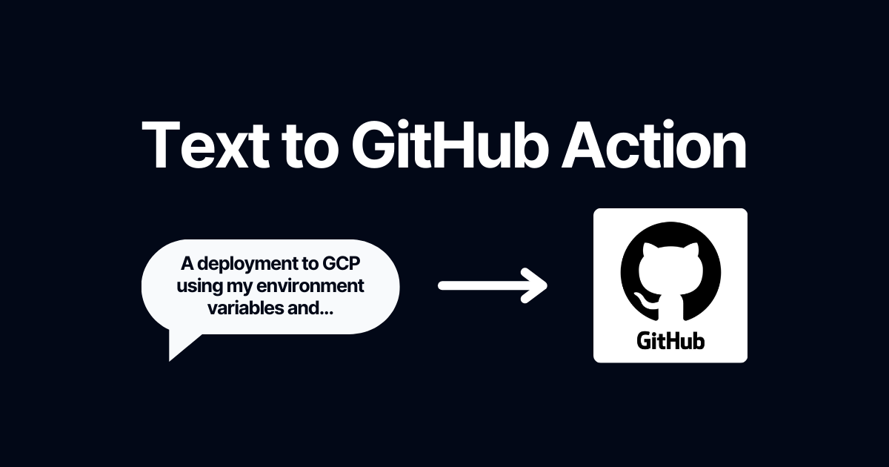

<h1 align="center" font-size="3rem">Text to Action</h1>

Create GitHub Actions by using your own words.



# 💻 Installation

Run the following commands:

```bash
git clone https://github.com/pulgueta/Text-to-Action

cd Text-to-Acion

bun install
```

If you are not using Bun and rather you use NPM, Yarn or PNPM, follow the previous steps but instead of using Bun to install, remove the [bun.lockb](bun.lockb) file and run one of these three commands:

```bash
npm install # If you use NPM

yarn install # If you use Yarn

pnpm install # If you use PNPM
```

# 📝 Usage

From the [.env.example](.env.example) file, copy the name of the environment variable and paste it into your own [.env.local](.env.local) or [.env](.env) file.

Run the following command:

```bash
bun dev # If you use Bun

npm run dev # If you use NPM

yarn dev # If you use Yarn

pnpm dev # If you use PNPM
```

That's it!

## Created by [Andrés Rodríguez](https://www.linkedin.com/in/and-rodr/)
